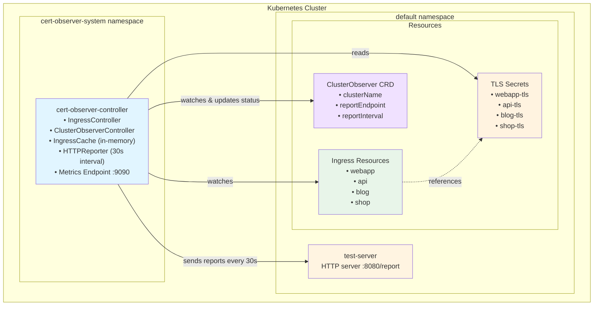

# Cert-Observer

A Kubernetes operator that watches Ingress resources, tracks TLS certificate expiry dates, and periodically reports them via HTTP POST.

## Overview

Cert-Observer monitors your cluster's Ingress resources and their TLS certificates:

- Watches Ingress resources and their referenced TLS Secrets
- Parses x509 certificates to extract expiry dates
- Maintains an in-memory cache of ingress and certificate data
- Sends JSON reports to a configured HTTP endpoint every 30 seconds

Useful for tracking certificate expiration across multiple clusters.

## Architecture



### Components

- **IngressController**: Watches Ingress resources and TLS Secrets, parses certificates, updates cache
- **ClusterObserverController**: Optional CRD for dynamic configuration management
- **IngressCache**: Thread-safe in-memory storage for ingress and certificate data
- **HTTPReporter**: Reads from cache and sends JSON reports every 30 seconds
- **Metrics Endpoint**: Exposes ingress count at `:9090/metrics` (Prometheus format)

The IngressController uses a watch mechanism to automatically reconcile Ingresses when their TLS Secrets change, keeping certificate expiry data fresh.

## Prerequisites

- Go 1.23+
- Docker
- kubectl
- Kind

## Quick Start

### 1. Create Kind Cluster

```bash
make kind-create
```

### 2. Deploy Examples

This deploys the test-server (where reports are sent) and example ingresses with TLS certificates:

```bash
make deploy-examples
```

### 3. Deploy the Operator

```bash
make deploy-local IMG=cert-observer:latest
```

### 4. View Reports

Check operator logs:

```bash
kubectl logs -n cert-observer-system deployment/cert-observer-controller-manager -f
```

Check test-server logs to see received reports:

```bash
kubectl logs -l app=test-server -f
```

You should see JSON reports with certificate expiry dates every 30 seconds.

### 5. Cleanup

```
make kind-delete
```

All created resources will be deleted

## Configuration

Configuration is managed via the ClusterObserver CRD. If no CRD exists, the reporter will not send reports.

### ClusterObserver CRD

Apply the sample configuration:

```bash
kubectl apply -f config/samples/observer_v1alpha1_clusterobserver.yaml
```

Example CRD:

```yaml
apiVersion: observer.cert-observer.io/v1alpha1
kind: ClusterObserver
metadata:
  name: clusterobserver-sample
  namespace: default
spec:
  clusterName: local-kind
  reportEndpoint: http://test-server.default.svc.cluster.local:8080/report
  reportInterval: 30s
```

Changes require pod restart to take effect.

### Metrics

Access metrics at `http://localhost:9090/metrics` (exposes total ingress count).

## Example JSON Output

```json
{
  "cluster": "local-kind",
  "ingresses": [
    {
      "namespace": "default",
      "name": "webapp",
      "hosts": [
        {
          "host": "webapp.local",
          "certificate": {
            "name": "webapp-tls",
            "expires": "2025-11-21T09:05:23Z"
          }
        }
      ]
    },
    {
      "namespace": "default",
      "name": "api",
      "hosts": [
        {
          "host": "api.local",
          "certificate": {
            "name": "api-tls",
            "expires": "2025-11-25T09:05:07Z"
          }
        }
      ]
    },
    {
      "namespace": "default",
      "name": "multi-host",
      "hosts": [
        {
          "host": "test1.local",
          "certificate": {
            "name": "webapp-tls",
            "expires": "2025-11-21T09:05:23Z"
          }
        },
        {
          "host": "test2.local",
          "certificate": {
            "name": "webapp-tls",
            "expires": "2025-11-21T09:05:23Z"
          }
        },
        {
          "host": "test3.local",
          "certificate": {
            "name": "api-tls",
            "expires": "2025-11-25T09:05:07Z"
          }
        }
      ]
    }
  ]
}
```

## Testing

Run unit tests:

```bash
make test
```

Test certificate updates:

```bash
# Generate new certificate
openssl req -x509 -nodes -days 90 -newkey rsa:2048 \
  -keyout /tmp/new-key.pem -out /tmp/new-cert.pem \
  -subj "/CN=webapp.local"

# Update secret
kubectl delete secret webapp-tls
kubectl create secret tls webapp-tls \
  --cert=/tmp/new-cert.pem --key=/tmp/new-key.pem

# Check logs for updated expiry date
kubectl logs -l app=test-server --tail=50
```

## Development

Run locally against your current kubeconfig context:

```bash
make run
```

Generate manifests after modifying RBAC markers:

```bash
make manifests
```

Lint code:

```bash
make lint
```

## Cleanup

```bash
make kind-delete
```

## Verification

Check operator logs:

```bash
kubectl logs -n cert-observer-system deployment/cert-observer-controller-manager
```

Check test-server logs:

```bash
kubectl logs -l app=test-server
```

## License

Apache License 2.0 - see LICENSE file for details.
